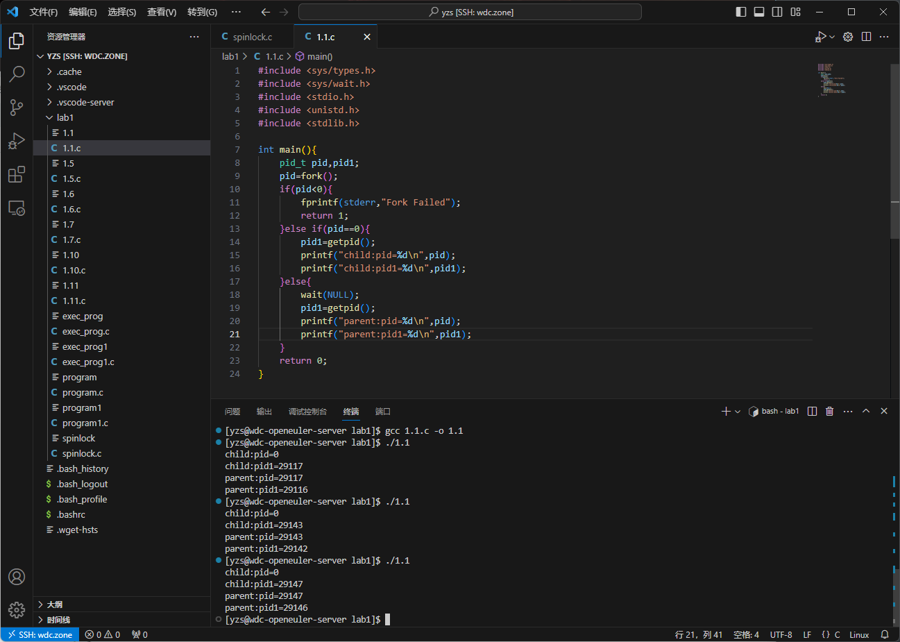

## 实验一Readme

**1、登录华为云，搭建openEuler操作系统环境。**

​	首先，登录华为云账号并申请一个预装openeuler系统的云服务器，设置好root账户后通过vscode使用ssh进行远程连接。本次实验在vscode上使用远程连接完成。

**2、编辑、编译、运行给定的程序，多次运行观察实验结果。**

​	如图，首先在/lab文件夹中新建.c文件并输入代码。

​	输入gcc编译指令将1.1.c编译成可执行文件。

​	将可执行文件独立运行三次，发现结果不尽相同。该程序在第8行处使用fork()函数创建了一个子进程，随后父子进程分别独立运行。在父进程中，pid>0，程序进入第三个if分支，其pid的值是返回的子进程的pid号，pid1的值由getpid()获得，是父进程的pid号，因此pid1=pid+1；在子进程中，pid=0，程序进入第二个if分支，其pid的值为0，pid1的值由getpid()获得，是子进程的pid号。同时，父、子进程的输出顺序不定。

**3、去除wait()后观察结果并进行理论分析, 比较程序在有无wait()函数时的运行结果，分析wait()函数的作用。**

​	wait(NULL)在父进程的作用是阻塞父进程的执行直到子进程退出，以防止僵尸进程的出现。在这个程序中，由于打印操作都在wait(NULL)之前，无法从打印结果判断父进程是否被阻塞，因此多次执行结果与含有wait(NULL)的程序相同。可以改变wait(NULL)的执行顺序如下：

​	如图，可以看到子进程总是在父进程之前打印，说明wait(NULL)阻塞了父进程的执行。

**4、添加一个全局变量，在父进程和子进程中对这个变量做不同操作，输出操作结果，同时输出两种变量的地址并进行分析。**

​	如图，定义了全局变量global并初始化为0。在父进程中global进行加一操作，在子进程中global进行加二操作，结果是父进程中global=1，子进程中global =2，且父子进程中global的地址相同。出现这种现象是因为父、子进程中global变量不相互共享，它们的虚拟地址相同，但物理地址不同。

**5、在子进程中调用system函数执行自己写的一段程序，在此程序中输出进程PID和其父进程PID进行比较分析。**

​	如图，编写程序program.c输出进程与父进程的pid号，并编译为可执行程序program。

​	如图，在子进程所执行的代码中加入了system调用program程序，其输出pid=54252，ppid=54251，可以发现这与父子进程的pid值不同，这是因为system调用创建了新的进程，其中新进程的父进程是原来的子进程。

**6、在子进程中调用exec函数执行自己写的一段程序，在此程序中输出进程PID和其父进程PID进行比较分析。**

​	如图，编写程序exec_prog.c输出进程与父进程的pid号，并编译为可执行程序exec_prog。

​	如图，在子进程分支一开始执行execl()函数后原分支剩余程序不再执行，转而执行exec_prog，说明在子进程中exec_prog取代了原程序的执行。因此在程序输出中，只输出了父进程的pid与pid1变量，以及exec_prog中输出的父子进程的pid值。

**7、修改给定程序，给一变量赋初值并创建两个线程，在两个线程中分别对此变量循环5000次做不同的操作并输出结果。**

​	如图，该程序是基于pthread线程库所编写的多线程程序。程序创建了一个全局变量var并初始化为0，在第一个线程中var加2重复5000次，在第二个程序中var减一重复5000次，最终输出var的值。其中关键代码分析如下：

* tid1，tid2声明了创建线程的标识符。attr1，attr2表示线程属性。
* pthread_attr_init()设置了线程的初始属性。
* pthread_create()创建了一个单独的线程。
* pthread_exit()让线程终止。
* pthread_join()等待线程的完成。

**8、多运行几遍程序观察运行结果。**

​	如图，可以发现程序运行结果并不每次都等于5000。这是因为这两个线程的执行顺序不固定，执行过程中可能遇到了脏数据改变了原来的值。

**9、完成上述过程的同步和互斥操作。**

​	如图，在原程序中引入互斥变量mutex，在每次var的值变化前使用pthread_mutex_lock()函数上锁，变化后使用pthread_mutex_unlock()函数解锁，确保了var的变化是原子的，这实现了原线程的同步与互斥。

**10、在两个线程中调用system函数执行自己写的一段程序，在此程序中输出线程TID及进程PID，进行分析。**

​	如图为所编程序program1.c，其输出了pid值与tid值。

​	如图，在每个线程中调用了program1，分别显示了进程的pid值与线程的tid值。由于system调用会创建新的进程，因此这两个pid值不同。

**11、在两个线程中调用exec函数执行自己写的一段程序，在此程序中输出线程TID及进程PID,进行分析。**

​	如图为所编程序execl_prog1.c，其输出了pid值与tid值。

​	如图，程序只输出一个线程的pid与tid值，这是因为执行完execl()函数后原进程被execl_prog1中的程序替换，其后的程序不会执行，也不会有新的线程被执行，程序返回原进程pid值与新线程pid值。

**12、参考实验指导书，编写模拟自旋锁程序代码，补充主函数代码，用自旋锁实现线程间的同步。编译并运行程序，分析运行结果。**

​	如图，程序运行多次后共享变量结果仍然正确，说明自旋锁有效。