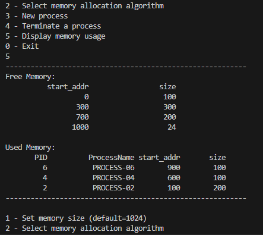

# 实验二Readme

## 2.1进程的软中断通信

### 实验代码

```c
#include <stdio.h>
#include <unistd.h>
#include <sys/wait.h>
#include <stdlib.h>
#include <signal.h>
int flag = 0;
void inter_handler()
{
    // TODO
    flag=1;
}
void waiting()
{ 
    // TODO
    sleep(5);
}
void nothing(){}
int main()
{
    // TODO: 五秒之后或接收到两个信号
    signal(SIGINT, inter_handler);
    signal(SIGQUIT, inter_handler);
    pid_t pid1 = -1, pid2 = -1;
    while (pid1 == -1)
        pid1 = fork();
    if (pid1 > 0)
    {
        while (pid2 == -1)
            pid2 = fork();
        if (pid2 > 0)
        {
            // TODO: 父进程
            waiting();
            if(flag){
                kill(pid1,16);
                kill(pid2,17);
                wait(NULL);
                wait(NULL);
                printf("\nParent process is killed!!\n");
                exit(0);
            }
        }
        else
        {
            // TODO: 子进程 2
            signal(17,nothing);
            pause();
            printf("\nChild process 2 is killed by parent!!\n");
            exit(0);
        }
    }
    else
    {
        // TODO：子进程 1
        signal(16,nothing);
        pause();
        printf("\nChild process 1 is killed by parent!!\n");
        exit(0);
    }
    return 0;
}
```

### 实验内容

（1）你最初认为运行结果会怎么样？写出你猜测的结果。

若程序开始后5秒内无键盘中断输入，程序无输出；若程序开始后5秒内捕捉到了键盘的中断信号，则程序输出为：

```tex
Child process 1 is killed by parent!!

Child process 2 is killed by parent!!

Parent process is killed!!
```

其中子程序1或2被杀死的顺序每次输出不一定相同。

（2）实际的结果什么样？有什么特点？在接收不同中断前后有什么差别？请将 5 秒内中断和 5 秒后中断的运行结果截图，试对产生该现象的原因进行分析。

5秒内中断结果：（分别为delete中断和quit中断）


5秒后中断结果：


实际结果与预想结果一致，其中子程序1或2被杀死的顺序每次输出不一定相同。若5秒内接收了来自键盘的中断，则`inter_handler()`函数执行，`flag`被置为1，父进程分别向子进程1、2发送16、17中断信号并等待子进程执行完毕，子进程接受到信号后结束`pause()`等待并销毁自己退出进程，随后父进程也销毁自己退出进程；若5秒内没有接收来自键盘的中断，则`flag`始终为0，父进程不会向子进程发送中断信号，子进程则会一直`pause()`等待直至中止进程，在此过程中程序无任何输出。

（3）改为闹钟中断后，程序运行的结果是什么样子？与之前有什么不同？

更改后的实验代码如下：

```c
#include <stdio.h>
#include <unistd.h>
#include <sys/wait.h>
#include <stdlib.h>
#include <signal.h>
int flag = 0;
void inter_handler()
{
    // TODO
    flag=1;
}
void waiting()
{ 
    // TODO
    //sleep(5);
    alarm(5);
    pause();
}
void nothing(){}
int main()
{
    // TODO: 五秒之后或接收到两个信号
    signal(SIGINT, inter_handler);
    signal(SIGQUIT, inter_handler);
    signal(SIGALRM, inter_handler);
    pid_t pid1 = -1, pid2 = -1;
    while (pid1 == -1)
        pid1 = fork();
    if (pid1 > 0)
    {
        while (pid2 == -1)
            pid2 = fork();
        if (pid2 > 0)
        {
            // TODO: 父进程
            sleep(1);//确保子进程进入pause()状态
            waiting();
            if(flag){
                kill(pid1,16);
                kill(pid2,17);
                wait(NULL);
                wait(NULL);
                printf("\nParent process is killed!!\n");
                exit(0);
            }
        }
        else
        {
            // TODO: 子进程 2
            signal(17,nothing);
            pause();
            printf("\nChild process 2 is killed by parent!!\n");
            exit(0);
        }
    }
    else
    {
        // TODO：子进程 1
        signal(16,nothing);
        pause();
        printf("\nChild process 1 is killed by parent!!\n");
        exit(0);
    }
    return 0;
}
```

5秒内中断结果：（分别为delete中断和quit中断）


5秒后中断结果：


可以看出，5秒内中断结果与原实验结果相同，5秒后中断结果新增输出。这是因为新的代码在`waiting()`函数中使用了`alarm(5)`和`pause()`进行了5秒等待，并使用`signal(SIGALRM, inter_handler)`接受时钟中断信号。当5秒没有接收来自键盘的中断时，`alarm(5)`会在第五秒结束时产生时钟中断信号并被`signal(SIGALRM, inter_handler)`接受，此时`inter_handler()`函数执行将`flag`置为1，父进程进入`if`分支分别向子进程1、2发送16、17中断信号并等待子进程执行完毕，子进程接受到信号后结束`pause()`等待并销毁自己退出进程，随后父进程也销毁自己退出进程。

（4）`kill`命令在程序中使用了几次？每次的作用是什么？执行后的现象是什么？

在程序中，`kill` 命令被使用了两次，分别是：

1. `kill(pid1, 16);`
   - 作用：向进程ID为 `pid1` 的进程发送信号16。
   - 执行后现象：父进程向子进程1发送信号16，使子进程退出`pause()`状态并终止。
2. `kill(pid2, 17);`
   - 作用：向进程ID为 `pid2` 的进程发送信号17。
   - 执行后现象：父进程向子进程2发送信号17，使子进程退出`pause()`状态并终止。

（5）使用`kill`命令可以在进程的外部杀死进程。进程怎样能主动退出？这两种退出方式哪种更好一些？

进程可以通过`exit(0)`主动退出。这两种退出方式更好取决于程序的需求。一般而言，正常退出更为可控，允许程序在退出之前执行一些清理操作，释放资源，确保数据完整性。使用`kill`命令退出是一种更为灵活的方式，可用于处理突发性的外部因素，如管理员发送的终止信号等。

## 2.2进程的管道通信

### 实验代码

```c
#include <unistd.h>
#include <signal.h>
#include <stdio.h>
#include <stdlib.h>
#include <sys/wait.h>

int pid1, pid2; // 定义两个进程变量

int main() {
    int fd[2];
    char InPipe[4001]; // 定义读缓冲区，4000个字符加上字符串结束符
    char c1 = '1', c2 = '2';

    pipe(fd); // 创建管道

    while ((pid1 = fork()) == -1); // 如果进程 1 创建不成功,则空循环

    if (pid1 == 0) { // 如果子进程 1 创建成功,pid1 为进程号
        lockf(fd[1], 1, 0); // 锁定管道

        for (int i = 0; i < 2000; i++) {
            write(fd[1], &c1, sizeof(char)); // 向管道写入字符 '1'
        }

        sleep(5); // 等待读进程读出数据

        lockf(fd[1], 0, 0); // 解除管道的锁定
        exit(0); // 结束进程 1
    } else {
        while ((pid2 = fork()) == -1); // 若进程 2 创建不成功,则空循环

        if (pid2 == 0) {
            lockf(fd[1], 1, 0); // 锁定管道

            for (int i = 0; i < 2000; i++) {
                write(fd[1], &c2, sizeof(char)); // 向管道写入字符 '2'
            }

            sleep(5);

            lockf(fd[1], 0, 0); // 解除管道的锁定
            exit(0);
        } else {
            wait(0); // 等待子进程 1 结束
            wait(0); // 等待子进程 2 结束

            int bytesRead = read(fd[0], InPipe, sizeof(InPipe) - 1); // 从管道中读出 4000 个字符
            InPipe[bytesRead] = '\0'; // 加字符串结束符

            printf("%s\n", InPipe); // 显示读出的数据

            exit(0); // 父进程结束
        }
    }
    return 0;
}
```

### 实验内容

（1）你最初认为运行结果会怎么样？

我认为运行结果是输出一串长为4000个字符的字符串，其中前2000个字符为1，后2000个字符为2。

（2）实际的结果什么样？有什么特点？试对产生该现象的原因进行分析。

实际结果如下：


实际结果与预想结果一致，输出中的1与2没有交叉。该程序创建了两个子进程，两个子进程分别向管道写入了2000次1和2，等待两个子进程结束后，父进程从管道中读取数据并输出。由于使用了锁`lockf`，两个子进程的写入不会交叉进行。

（3）实验中管道通信是怎样实现同步与互斥的？如果不控制同步与互斥会发生什么后果？

实验中管道通信是通过`lockf(fd,mode,size)`锁实现同步与互斥,其中`fd`是文件描述字；`mode`是锁定方式，`mode=1`表示加锁，`mode=0`表示解锁；`size`是指定文件`fd`的指定区域，用`0`表示从当前位置到文件结尾。如果不控制同步与互斥就无法控制进程1与2的写入时机，会导致字符1与2被交替写入，结果如下：


## 2.3内存的分配与回收

### 实验代码

```c
/*按 FF 算法重新整理内存空闲块链表*/
void rearrange_FF()
{
    //合并相邻内存
    struct free_block_type* node = free_block;
    struct free_block_type* nextnode = node->next;
    while (nextnode != NULL) {
        if (node->start_addr + node->size == nextnode->start_addr) {
            node->size = node->size + nextnode->size;
            node->next = nextnode->next;
            free(nextnode);
            nextnode = node->next;
            continue;
        }
        node = nextnode;
        nextnode = node->next;
    }
}

/*按 BF 算法重新整理内存空闲块链表*/
void rearrange_BF()
{
    struct free_block_type* node = free_block;
    struct free_block_type* nextnode = node->next;
    struct free_block_type* prenode = NULL;
    int num = 1;//记录链表长度
    //合并相邻内存
    while (nextnode != NULL) {
        if (node->start_addr + node->size == nextnode->start_addr) {
            node->size = node->size + nextnode->size;
            node->next = nextnode->next;
            free(nextnode);
            nextnode = node->next;
            continue;
        }
        node = nextnode;
        nextnode = node->next;
        num++;
    }
    //对空闲内存列表从小至大排序
    struct free_block_type* new_head = NULL;
    struct free_block_type* new_tail = NULL;
    struct free_block_type* min_node;
    struct free_block_type* pre_min_node;
    for (int i = 0; i < num; i++) {
        min_node = free_block;
        pre_min_node = NULL;
        node = free_block;
        prenode = NULL;
        while (node != NULL) {
            if (node->size < min_node->size) {
                min_node = node;
                pre_min_node = prenode;
            }
            prenode = node;
            node = node->next;
        }
        //将每次循环中的最小空闲内存连接到新的链表中
        if (new_head == NULL) {
            new_head = min_node;
            new_tail = min_node;
            if (pre_min_node != NULL) {
                pre_min_node->next = min_node->next;
            }
            else {
                free_block = min_node->next;
            }
        }
        else {
            new_tail->next = min_node;
            new_tail = min_node;
            if (pre_min_node != NULL) {
                pre_min_node->next = min_node->next;
            }
            else {
                free_block = min_node->next;
            }
        }
    }
    new_tail->next = NULL;
    free_block = new_head;
}

/*按 WF 算法重新整理内存空闲块链表*/
void rearrange_WF()
{
    struct free_block_type* node = free_block;
    struct free_block_type* nextnode = node->next;
    struct free_block_type* prenode = NULL;
    int num = 1;//记录链表长度
    //合并相邻内存
    while (nextnode != NULL) {
        if (node->start_addr + node->size == nextnode->start_addr) {
            node->size = node->size + nextnode->size;
            node->next = nextnode->next;
            free(nextnode);
            nextnode = node->next;
            continue;
        }
        num++;
        node = nextnode;
        nextnode = node->next;
    }
    //对空闲内存列表从小至大排序
    struct free_block_type* new_head = NULL;
    struct free_block_type* new_tail = NULL;
    struct free_block_type* max_node;
    struct free_block_type* pre_max_node;
    for (int i = 0; i < num; i++) {
        max_node = free_block;
        pre_max_node = NULL;
        node = free_block;
        prenode = NULL;
        while (node != NULL) {
            if (node->size > max_node->size) {
                max_node = node;
                pre_max_node = prenode;
            }
            prenode = node;
            node = node->next;
        }
        //将每次循环中的最大空闲内存连接到新的链表中
        if (new_head == NULL) {
            new_head = max_node;
            new_tail = max_node;
            if (pre_max_node != NULL) {
                pre_max_node->next = max_node->next;
            }
            else {
                free_block = max_node->next;
            }
        }
        else {
            new_tail->next = max_node;
            new_tail = max_node;
            if (pre_max_node != NULL) {
                pre_max_node->next = max_node->next;
            }
            else {
                free_block = max_node->next;
            }
        }
    }
    new_tail->next = NULL;
    free_block = new_head;
}

int allocate_mem(struct allocated_block* ab)
{
    struct free_block_type* fbt, * pre;
    int request_size = ab->size;
    fbt = free_block;
    pre = free_block;
    while (fbt != NULL) {
        if (fbt->size <= request_size) {//寻找小于请求空间的空闲内存块
            pre = fbt;
            fbt = fbt->next;
            continue;
        }
        if (fbt->size <= request_size + MIN_SLICE) {//找到可满足空闲分区且但分配后剩余空间比较小，则一起分配
            if (fbt == pre) {
                free_block = free_block->next;
                ab->size = fbt->size;
                ab->start_addr = fbt->start_addr;
                free(fbt);
                rearrange(ma_algorithm);
                return 1;
            }
            else {
                pre->next = fbt->next;
                ab->size = fbt->size;
                ab->start_addr = fbt->start_addr;
                free(fbt);
                rearrange(ma_algorithm);
                return 1;
            }
        }
        else {//找到可满足空闲分区且分配后剩余空间足够大，则分割
            ab->start_addr = fbt->start_addr;
            fbt->start_addr = ab->start_addr + ab->size;
            fbt->size = fbt->size - ab->size;
            rearrange(ma_algorithm);
            return 1;
        }
    }
    //找不可满足需要的空闲分区但空闲分区之和能满足需要，则采用内存紧缩技术，进行空闲分区的合并，然后再分配
    fbt = free_block;
    pre = free_block;
    fbt->start_addr = DEFAULT_MEM_START;
    int address = fbt->start_addr + fbt->size;
    while (fbt->next != NULL) {
        pre = fbt;
        fbt = fbt->next;
        fbt->start_addr = address;
        address += fbt->size;
    }
    struct allocated_block* _ab = allocated_block_head;
    struct allocated_block* _pre = allocated_block_head;
    _ab->start_addr = address;
    address += _ab->size;
    while (_ab->next != NULL) {
        _pre = _ab;
        _ab = _ab->next;
        _ab->start_addr = address;
        address += _ab->size;
    }
    //内存紧缩后再次尝试分配
    rearrange(ma_algorithm);
    request_size = ab->size;
    fbt = free_block;
    pre = free_block;
    while (fbt != NULL) {
        if (fbt->size <= request_size) {
            pre = fbt;
            fbt = fbt->next;
            continue;
        }
        if (fbt->size <= request_size + MIN_SLICE) {//找到可满足空闲分区且但分配后剩余空间比较小，则一起分配
            if (fbt == pre) {
                free_block = free_block->next;
                ab->size = fbt->size;
                ab->start_addr = fbt->start_addr;
                free(fbt);
                rearrange(ma_algorithm);
                return 1;
            }
            else {
                pre->next = fbt->next;
                ab->size = fbt->size;
                ab->start_addr = fbt->start_addr;
                free(fbt);
                rearrange(ma_algorithm);
                return 1;
            }
        }
        else {//找到可满足空闲分区且分配后剩余空间足够大，则分割
            ab->start_addr = fbt->start_addr;
            fbt->start_addr = ab->start_addr + ab->size;
            fbt->size = fbt->size - ab->size;
            rearrange(ma_algorithm);
            return 1;
        }
    }
    //内存分配失败
    return -1;

    // 根据当前算法在空闲分区链表中搜索合适空闲分区进行分配，分配时注意以下情况：
    //  1. 找到可满足空闲分区且分配后剩余空间足够大，则分割
    //  2. 找到可满足空闲分区且但分配后剩余空间比较小，则一起分配
    //  3. 找不可满足需要的空闲分区但空闲分区之和能满足需要，则采用内存紧缩技术，进行空闲分区的合并，然后再分配
    // 4. 在成功分配内存后，应保持空闲分区按照相应算法有序
    // 5. 分配成功则返回 1，否则返回-1
}

/*将 ab 所表示的已分配区归还，并进行可能的合并*/
int free_mem(struct allocated_block* ab)
{
    int algorithm = ma_algorithm;
    struct free_block_type* fbt, * prenode, * node;
    fbt = (struct free_block_type*)malloc(sizeof(struct free_block_type));//将ab的信息复制到一个新的fbt中
    if (!fbt)
        return -1;
    fbt->start_addr = ab->start_addr;
    fbt->size = ab->size;
    fbt->next = NULL;
    //将新节点插入到空闲分区队列末尾
    node = free_block;
    int num = 1;
    while (node->next != NULL) {
        num++;
        node = node->next;
    }
    node->next = fbt;
    num++;
    //对空闲链表按照起始地址有序排列
    node = free_block;
    struct free_block_type* new_head = NULL;
    struct free_block_type* new_tail = NULL;
    struct free_block_type* min_node;
    struct free_block_type* pre_min_node;
    for (int i = 0; i < num; i++) {
        min_node = free_block;
        pre_min_node = NULL;
        node = free_block;
        prenode = NULL;
        while (node != NULL) {
            if (node->start_addr < min_node->start_addr) {
                min_node = node;
                pre_min_node = prenode;
            }
            prenode = node;
            node = node->next;
        }
        //将每次循环中的最小空闲内存连接到新的链表中
        if (new_head == NULL) {
            new_head = min_node;
            new_tail = min_node;
            if (pre_min_node != NULL) {
                pre_min_node->next = min_node->next;
            }
            else {
                free_block = min_node->next;
            }
        }
        else {
            new_tail->next = min_node;
            new_tail = min_node;
            if (pre_min_node != NULL) {
                pre_min_node->next = min_node->next;
            }
            else {
                free_block = min_node->next;
            }
        }
    }
    new_tail->next = NULL;
    free_block = new_head;
    //检查并合并相邻的空闲分区,将空闲链表重新按照当前算法排序
    rearrange(algorithm);

    // 进行可能的合并，基本策略如下
    // 1. 将新释放的结点插入到空闲分区队列末尾
    // 2. 对空闲链表按照地址有序排列
    // 3. 检查并合并相邻的空闲分区
    // 4. 将空闲链表重新按照当前算法排序

    return 1;
}

/*释放链表并退出 */
void do_exit() {
    struct free_block_type* fbt = free_block;
    struct free_block_type* node;
    while (fbt != NULL) {
        node = fbt;
        fbt = fbt->next;
        free(node);
    }
    struct allocated_block* ab = allocated_block_head;
    struct allocated_block* _node;
    while (ab != NULL) {
        _node = ab;
        ab = ab->next;
        free(_node);
    }
}

/*根据pid号寻找进程所占内存 */
struct allocated_block* find_process(int pid) {
    struct allocated_block* ab = allocated_block_head;
    while (ab != NULL) {
        if (ab->pid == pid) {
            return ab;
        }
        ab = ab->next;
    }
    return NULL;
}
```

### 实验内容

1. 算法测试

   在测试中，我选择内存大小为默认初始大小1024，分别创建所占内存大小为100、200、300、100、200、100的进程1、2、3、4、5、6以测试内存分配算法的正确性，随后删除进程1、3、5以测试释放内存算法的正确性，然后创建内存大小为10的进程7测试内存分配的策略是否符合预期，最后创建内存大小为600的进程8以测试内存紧缩算法的正确性。

   （1）FF算法

   

   

   

   ​	可以看到，空闲内存链表按起始地址从小至大排列，在进行内存分配时，从链首开始顺序查找，直至找到一个能满足进程大小要求的空闲分区为止。

   

   ​	可以看到，内存紧缩成功，新的进程所占空间位于紧缩后的空间中。

   （2）BF算法

   

   

   

   ​	可以看到，空闲分区链表按分区大小由小到大排序，链表中查找第一个满足要求的分区分配给新进程。

   

   ​	可以看到，内存紧缩成功，新的进程所占空间位于紧缩后的空间中。

   （3）WF算法

   

   

   

   可以看到，空闲分区链表按分区大小由大到小排序，链表中查找第一个满足要求的分区分配给新进程。

   

   可以看到，内存紧缩成功，新的进程所占空间位于紧缩后的空间中。

2. 对涉及的 3 个算法进行比较，包括算法思想、算法的优缺点、在实现上如何提高算法
   的查找性能。

   **算法思想：**

   - FF算法：按照地址的升序，从内存块链表的头部开始查找第一个能够满足需求的内存块。
   - BF算法：在所有满足需求的内存块中，选择最小的那个内存块来分配。
   - WF算法：在所有满足需求的内存块中，选择最大的那个内存块来分配。

   **算法的优缺点：**

   - FF算法：
     - 优点：简单快速，少浪费内存，适用于分配较小的内存块。
     - 缺点：可能会导致较大的内部碎片，不够高效。
   - BF算法：
     - 优点：能够更充分地利用内存空间，减少外部碎片。
     - 缺点：查找过程相对较慢，可能会导致一些较大的内存块无法分配。
   - WF算法：
     - 优点：能够避免较大的内存块无法分配，减少外部碎片。
     - 缺点：可能会导致较小的内存块无法分配，浪费一些内存空间。

   **提高算法的查找性能的实现方法：**

   - 使用合适的数据结构：使用二叉搜索树、红黑树等数据结构，可以加快查找过程。
   - 分区策略：将内存划分为不同大小的分区，根据分区大小选择合适的分配算法。
   - 空闲块合并：当释放一个内存块时，尝试将相邻的空闲块合并为一个更大的空闲块，减少外部碎片。
   - 压缩内存：定期进行内存压缩操作，将多个小的空闲块合并为一个大的空闲块。

3. 3 种算法的空闲块排序分别是如何实现的。

   ​	三种算法的排序均为创建一个新的链表，按不同的排序标准遍历原空闲内存链表，每次找到原链表所有节点中某一属性最小或最大的节点，将其从原链表删除后添加到新链表中，不断重复即可获得一个排列好的新链表。

4. 结合实验，举例说明什么是内碎片、外碎片，紧缩功能解决的是什么碎片。

   ​	内碎片指的是已分配给进程的内存块中，有一部分空间没有被有效利用而浪费掉的现象。它发生在一个内存块内部的未被使用的空间。在本实验中如果空闲内存块大小与进程申请的内存大小之差小于MIN_SLICE，程序就将这个空闲内存块全部分配给该进程，这样该进程不需要完全利用所有分配内存，产生了内碎片。

   ​	外碎片指的是别的进程占用的内存块之间的未分配空闲内存块。外碎片发生在整个内存空间中，由于内存块的分配和释放导致零散的未分配空间。外碎片虽然总空间很大，但无法满足一个大内存请求。例如分配大小为600的进程8时，由于每个空闲内存块的大小都小于600，此时这些空闲内存块构成了外碎片。

   ​	紧缩功能是一种内存管理机制，旨在解决外碎片问题。它通过将已分配内存块之间的空闲内存块移动，以创建一个较大的连续空闲区域。这样，当一个大块内存请求到来时，可以更容易地找到足够大的连续空闲区域来满足该请求。

5. 在回收内存时，空闲块合并是如何实现的？

   ​	回收内存时，遍历空闲块链表，若相邻结点的起始地址之差为前一节点的内存大小，则合并这两个节点。
