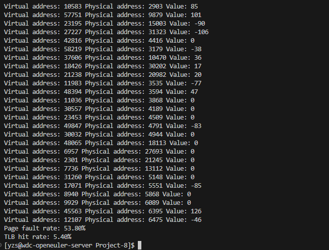

# 实验三Readme：虚拟存储模拟

## 实验描述

​	本实验编写了一个虚拟内存的模拟程序。我们假设存在一个进程，其完整数据位于二进制文件`BACKING_STORE.bin`中，进程所需要访问的逻辑地址按顺序存放于`addresses.txt`文件中。程序将读取包含逻辑地址的文件，并使用 TLB 和页表将每个逻辑地址转换为相应的物理地址，如遇缺页错误将使用FIFO算法将页面换入，然后输出存储在转换后物理地址上的字节值，以实现虚拟存储的模拟。

## 实验内容

### 地址转化

​	32 位逻辑地址由 16 个未使用位、8 个页面位和 8 个偏移位组成。因此，首先要从逻辑地址中提取页码和偏移量。如果页码在 TLB 中，则直接使用 TLB；否则，就会出现 TLB 缺失，并在页表中查找。如果该页面无效，即不在内存中，则需要处理页面故障。代码实现如下：

```c
uint32_t translate_address(uint32_t logical) {//地址转化
    ++total_cnt;
    uint32_t page_number, offset, frame_number;
    page_number = get_page_number(logical);
    offset = get_offset(logical);
    if(!check_TLB(page_number, &frame_number)) {//TLB 未击中
        ++TLB_miss_cnt;
        if(page_valid[page_number] == 0) {//缺页处理
            handle_page_fault(page_number);
        }
        frame_number = page_table[page_number];
        update_TLB(page_number, frame_number);
    }
    return get_physical_address(frame_number, offset);
}
```

### TLB实现

​	TLB 以结构体的形式实现的。检查某个页面是否在 TLB 中就需要遍历 TLB，虽然效率不高，但由于 TLB_SIZE 较小，所以时间开销小。此外，我还使用FIFO算法来更新 TLB。代码实现如下：

```c
typedef struct {
    uint8_t valid;
    uint32_t page, frame;
} T;
T TLB[TLB_SIZE];//模拟TLB

int check_TLB(uint32_t page_number, uint32_t *frame_number) {//检查page_number是否在TLB中
    for(size_t i = 0; i < TLB_SIZE; ++i) {
        if(TLB[i].valid && TLB[i].page == page_number) {
            *frame_number = TLB[i].frame;
            return 1;
        }
    }
    return 0;
}

void update_TLB(uint32_t page_number, uint32_t frame_number) {//使用FIFO算法更新TLB
    size_t victim = next_available_TLB % TLB_SIZE;
    next_available_TLB = (next_available_TLB + 1) % TLB_SIZE;
    TLB[victim].valid = 1;
    TLB[victim].page = page_number;
    TLB[victim].frame = frame_number;
}
```

### 页表实现

​	使用page_table数组记录页表，page_valid数据记录有效位，使用FIFO算法选取替换页面。代码实现如下：

```c
uint32_t page_table[NUMBER_OF_PAGES];//模拟页表
uint8_t page_valid[NUMBER_OF_PAGES];//模拟页表有效位

uint32_t select_victim_frame() {//使用FIFO算法选取替换页面
    if(next_available_frame < NUMBER_OF_FRAMES) {
        return next_available_frame++;
    }
    uint32_t victim = (next_available_frame++) % NUMBER_OF_FRAMES;
    for(size_t i = 0; i < NUMBER_OF_PAGES; ++i) {
        if(page_valid[i] && page_table[i] == victim) {
            page_valid[i] = 0;
            break;
        }
    }
    return victim;
}

void handle_page_fault(uint32_t page_number) {//处理缺页错误
    page_table[page_number] = select_victim_frame();
    fseek(backing_storage, page_number * PAGE_SIZE, SEEK_SET);//移动文件读写指针
    fread(memory + page_table[page_number] * PAGE_SIZE, sizeof(int8_t), PAGE_SIZE, backing_storage);//实现从模拟磁盘将页帧换入模拟内存
    page_valid[page_number] = 1;
    ++page_fault_cnt;
}
```

### 结果

